# DsMMO

## Skills
Everytime you use an skill you get experience and over time you will level up that ability.
Keep in mind that every level costs double the exp that you needed for the last level which means reaching high levels will be much slower than reaching low levels.
Depending on the skill, new levels will enable you to perform actions faster, give you new skills, give you random bonuses or give you the option of performing rituals (see below).

Everytime your character dies you loose half your exp in every skill.

## Rituals
Rituals are a way of sacrificing items to get rare items or performing useful actions.
They are conducted by placing the nedded items on the floor (they dont have to be placed in any order. Just near one another) and then inspecting the center peace of the sacrifice
(if the center peace is an item you can also pick, you have to use "force inspect" by pressing a certain button while clicking on it. You can set "Force inspect in you control settings).

Do not use stacked items!
The ritual will treat them as a single item anad you will loose all the other items in the stack (or the ritual wont work at all)

## Skills

The lore says that all abilities have a 50 percent better chance to be successfull during a full moon...

### CHOP
The higher your CHOP-level, the faster you will be able to chop trees

### MINE
The higher your MINE-level, the faster you will be able to mine stones

### ATTACK

#### Level 1: Explosive touch

#### Level 2: Beetaliation
 
### PLANT

#### Level 1: Double the shit

#### Level 2: Plant another day

#### Level 3: Ritual of redness
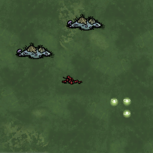

#### Level 4: Ritual of red juicyness
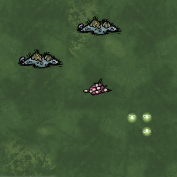

#### Level 6: Ritual of bananana
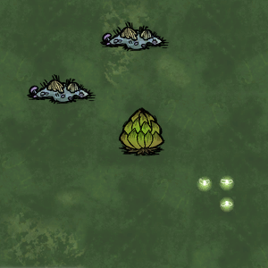

#### Level 8: Ritual of magic mushrooms
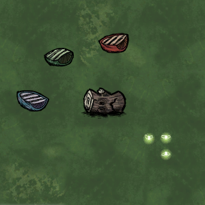

### DIG

#### Level 1: Treasurehunter

#### Level 2: Ritual of mole infestation
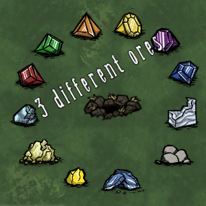

#### Level 3: Ritual of mole attraction
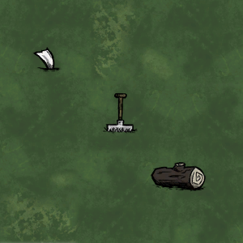

#### Level 5: Ritual of roman streets
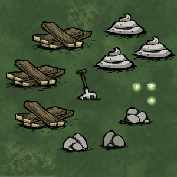

### EAT

#### Level 3: Self-cannibalism

#### Level 5: Ritual of death

#### Level 8: Ritual of a new life
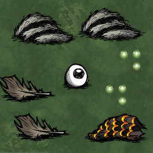

### PICK

#### Level 1: Ghosty fireflies

#### Level 2: Ritual of the longest Twig
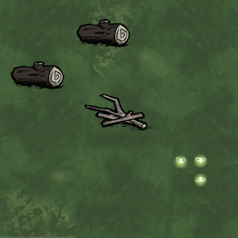

#### Level 3: Ritual of reggae dreams
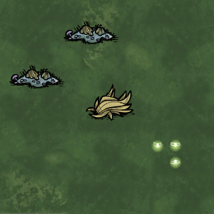

#### Level 5: Ritual of shiny balls

#### Level 7: Ritual of Poe

### BUILD

#### Level 1: Ritual of pussy love
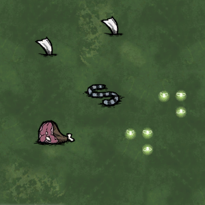

#### Level 2: Ritual of splishy splashy

#### Level 3: Ritual of dumb monkeys
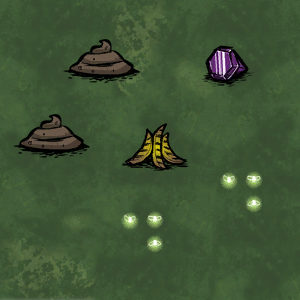

#### Level 4: Ritual of arctic fishing
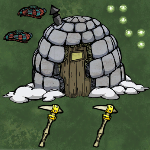

#### Level 5: Ritual of whalers feast
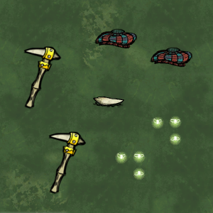

#### Level 6: Ritual of Saurons bird
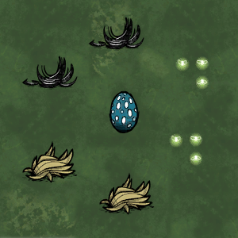

#### Level 7: Ritual of the pigable flame
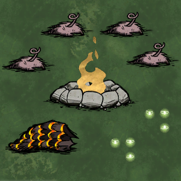

#### Level 8: Ritual of rerevival

#### Level 10: Ritual of homing flame
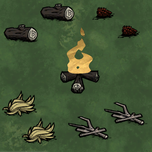