# 

Inspired by McMMO for Minecraft, the purpose of this mod is to reward players for every action they do and make the game less grindy the longer they play (and survive).
You will get experience for several actions and over time get level-ups that let you learn new skills, rituals and increase the effect rate and chance of skills and rituals that you have already learned.
But be careful. Every time you die, you loose half of your experience.

The lore says that all skills and rituals have a 50 percent better chance to be successful during a full moon...


# Rituals
Rituals are a way of sacrificing items to build rare structures or performing useful actions.

## Conducting a ritual
* Place all the needed items on the ground (**but don't use stacked items or you will loose them**)
* They don't need to be placed in any specific order or arrangement but there is always a middle piece that needs to be near to all the other ingredients.
* When you have laid out all the needed items, **inspect** the middle piece (you may have to **force inspect**. You can set its key command in the settings).


# Skills
Skills give you bonuses when you conduct an action.
The higher your level in the matching DsMMO-action, the higher is your chance and / or effectiveness of the skill.


# Skill- and ritual-tree:


## CHOP
The higher your CHOP-level, the faster you will be able to chop trees


## MINE
The higher your MINE-level, the faster you will be able to mine stones


## ATTACK
You get experience for: Attacking other player, NPCs or structures and when you are attacked.

### Level 1: Explosive touch
Every attack you deal has a chance of doing extra damage (same damage like of a spear).

### Level 2: Beetaliation
Every time you are attacked, there is a chance that you spawn a bee, that will attack the source that attacked you.


## PLANT

### Level 1: Double the shit
Fertilizing has a chance of being extra effective.

### Level 2: Plant another day
Harvesting crops has a chance of getting double drops. Possible drops are:
With a 50 percent chance: lightbulb, red gem, blue gem
With a 30 percent chance: mandrake, purple gem, cutreeds, slurper pelt, furtuft
With a 20 percent chance: moonrocks, beardhair, yellow gem, orange gem

### Level 3: Ritual of redness
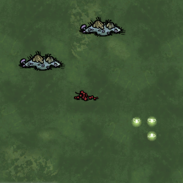

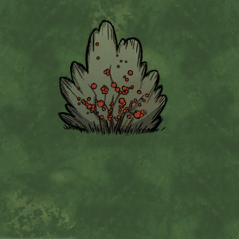

### Level 4: Ritual of red juiciness
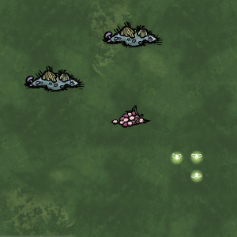


### Level 6: Ritual of bananana
Can only be performed in the caves.

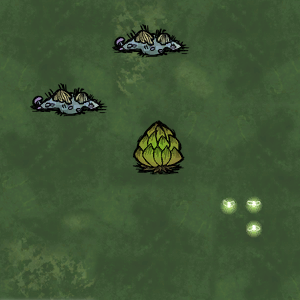

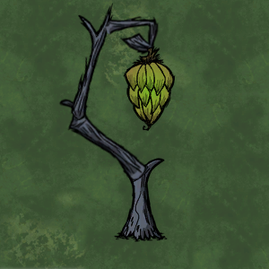

### Level 8: Ritual of magic mushrooms
Creates a mushroom with random color.

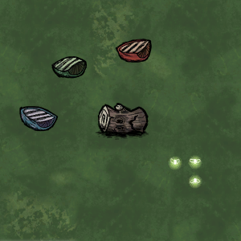

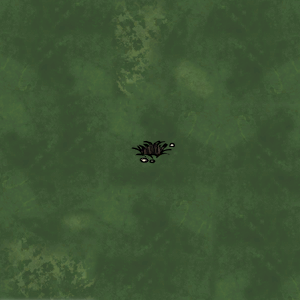


## DIG

### Level 1: Treasure hunter
Using your shovel for digging has a chance of spawning additional items

### Level 2: Ritual of mole infestation
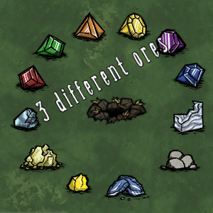

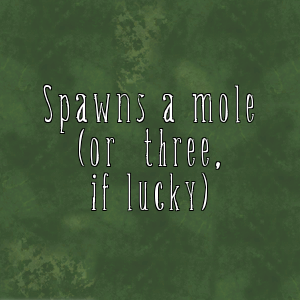

### Level 3: Ritual of mole attraction
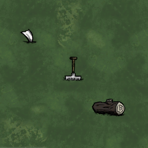


### Level 5: Ritual of roman streets
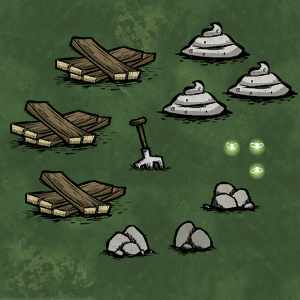

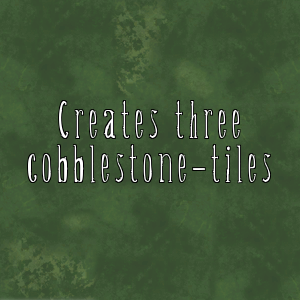


## EAT

### Level 3: Self-cannibalism
Exchange DsMMO-experience to completely fill your health, hunger or sanity.
Use this skill with the following chat-command:
```
#dsmmo eat [action] [health | hunger | sanity]
```
The higher your EAT-action-level the less DsMMO-experience is used for healing yourself.

### Level 5: Ritual of death
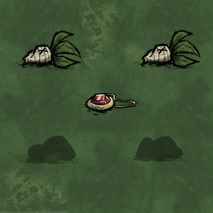

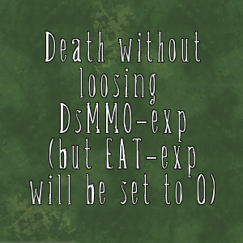

### Level 8: Ritual of a new life


## PICK

### Level 1: Ghosty fireflies
As a ghost, haunting evil flowers has a chance to turn into fireflies. The higher your PICK-action-level, the higher your chance of succeeding.

### Level 2: Ritual of the longest Twig
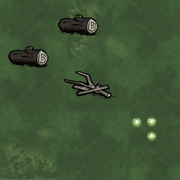

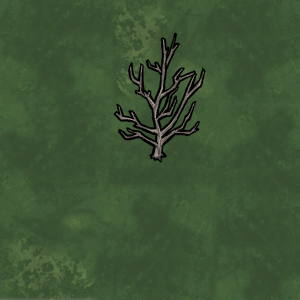

### Level 3: Ritual of reggae dreams
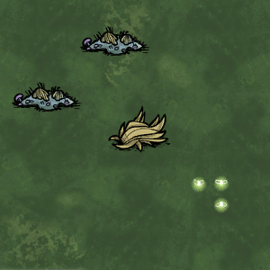


### Level 5: Ritual of shiny balls
Can only be performed in the caves.

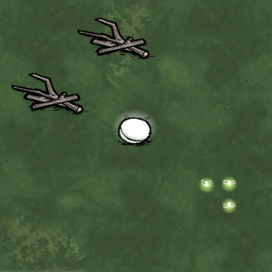

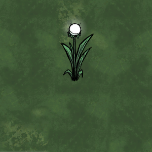

### Level 7: Ritual of Poe
Can only be performed on marsh-ground.

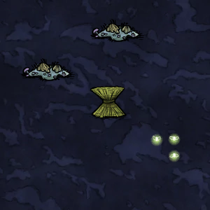

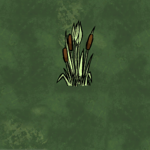


## BUILD

### Level 1: Ritual of pussy love
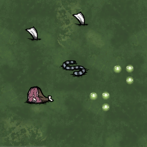

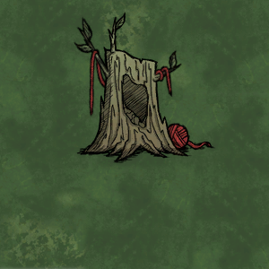

### Level 2: Ritual of splishy splashy
The resulting pond type depends on the ground and place (forest / cave, Marsh-ground / other) where it is summoned.

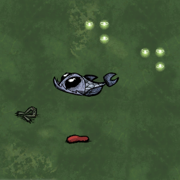

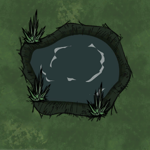

### Level 3: Ritual of dumb monkeys
Can only be performed in the caves.

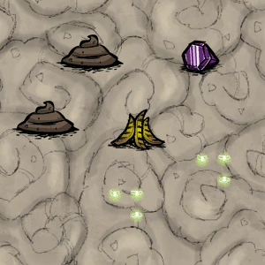

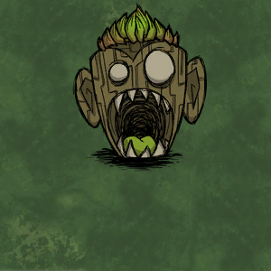

### Level 4: Ritual of arctic fishing
Removes an existing walrus camp.


### Level 5: Ritual of whalers feast
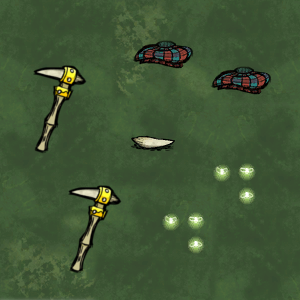


### Level 6: Ritual of Saurons bird


### Level 7: Ritual of the pigable flame
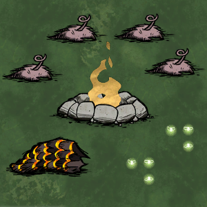


### Level 8: Ritual of rerevival
(only works with player skeletons)

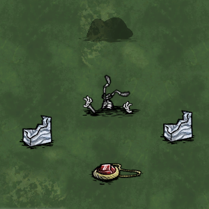

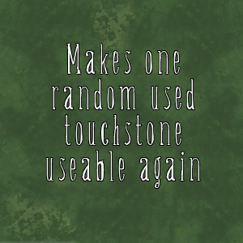

### Level 10: Ritual of homing flame
Costs one Build-level!
Does not teleport to campfires.


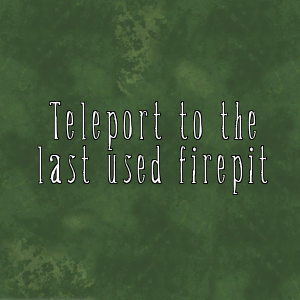


# User-commands
User-commands are available for all players. To use them they have to **whispered** into the chat.

## ```#dsmmo [action]```
This command spawns a mini-sign at your current position (which will despawn over time). The sign always shows your last used DsMMO-action and if you examine it, you will be shown your current level, experience and learned skills.
If you specify an action, the mini-sign will show the specified action instead of the last used one.

## ```#dsmmo list```
Lists the levels of all your DsMMO-actions

## ```#dsmmo eat [action] [hunger | health | sanity]```
See the skill [Self-cannibalism](#level-3-self-cannibalism)


# Admin-commands
Admin-commands are only available if you have remote access to the server-console.

## ```dsmmo_reset(player_name)```
Resets all DsMMO-actions to level 0 for the specified player.
The target player has to be online for the command to work properly.

## ```dsmmo_set(player_name, action, level)```
Sets the level of a specific DsMMO-action to the specified level for the specified player.
The target player has to be online for the command to work properly.


This is a server-only mod which means no fancy UI but other users don't need to download anything as long as the server-admin has this mod activated